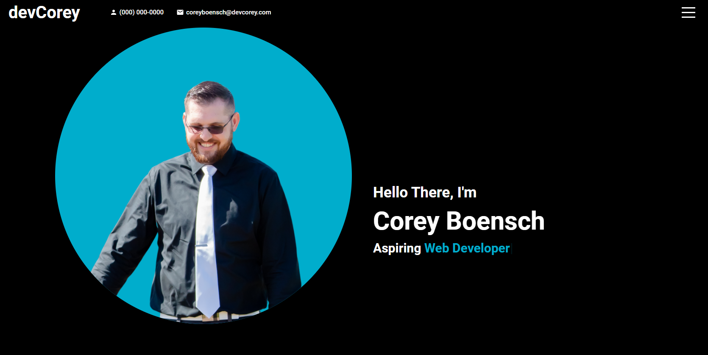
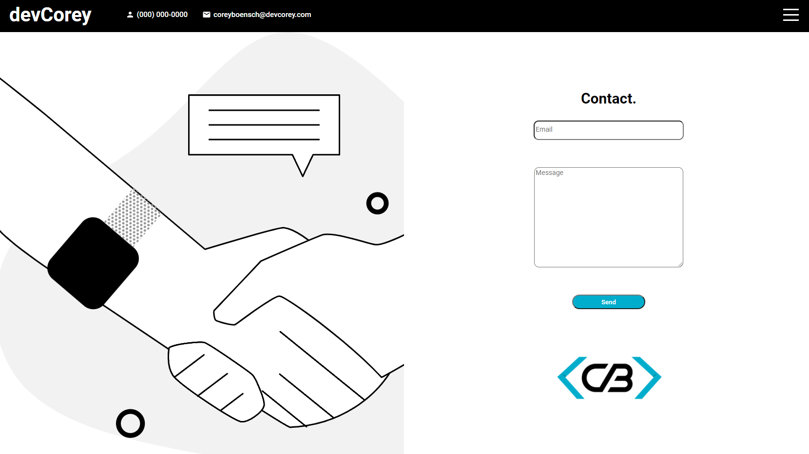

  # React Portfolio
  
  
  
  
  
  
  
    

  ## Table-of-Contents

  * [Description](#description)
  
  * [License](#license)
    
  * [Contributing](#contributing)
 
 
  ## [Description](#table-of-contents)
  This is my React App Portfolio. Go check it out [HERE!](https://cboensch6505.github.io/reactPortfolio/)
  
  

  ## [License](#table-of-contents)

  The application is covered under the following license:

  
  [mit](https://choosealicense.com/licenses/mit)
    
    

  ## [Contributing](#table-of-contents)
  
  
  Thank you for your interest in helping out; however, I will not be accepting contributions from third parties.
    
